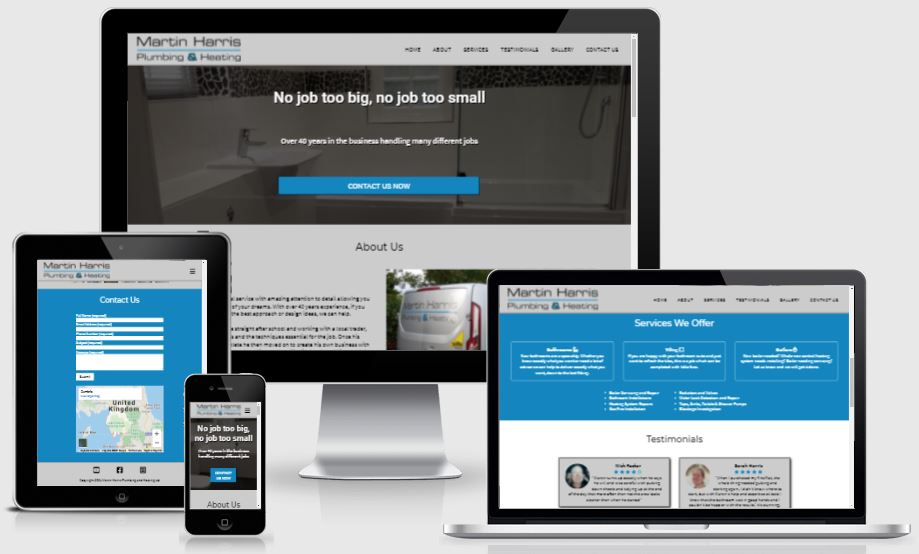
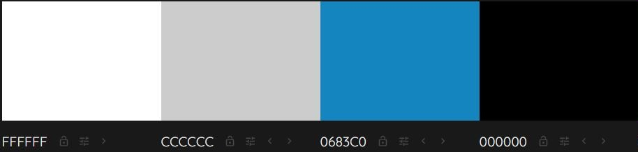
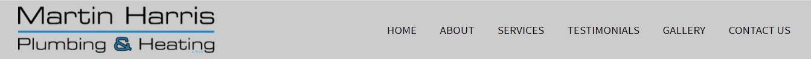
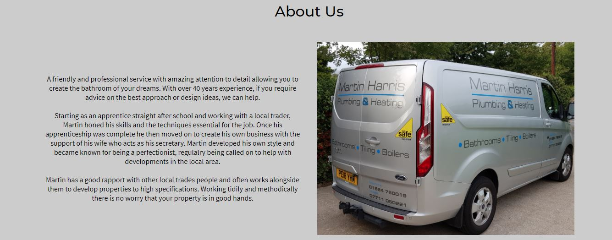
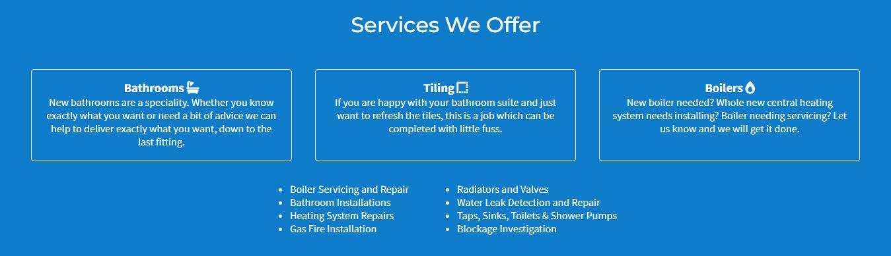
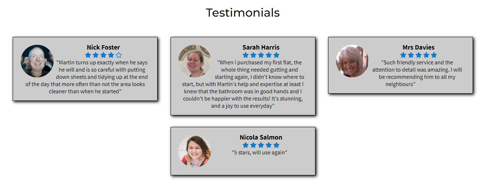
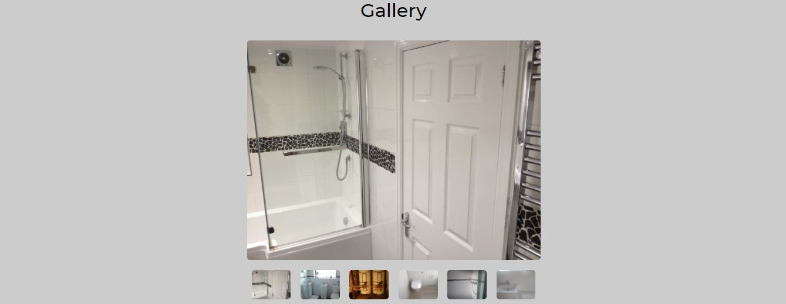
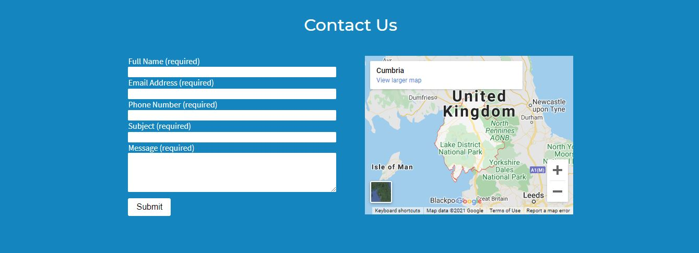
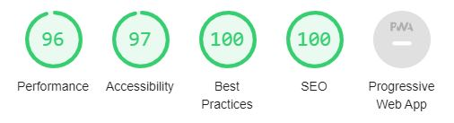
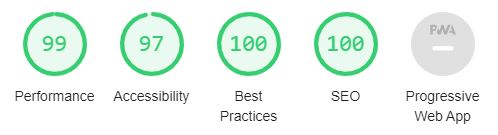

# Martin Harris Plumbing and Heating Ltd

[Click here to view the live site.](https://ashfoster.github.io/mh-plumbing-heating/)

## Overview

This is a website for a plumbing and heating business based in the north of England named Martin Harris Plumbing and Heating Ltd. It has been designed to showcase what the company has to offer, to be easy to navigate, and to be responsive across a range of popular devices.

Its primary focus is to allow its users to learn more about the company and what services are available, and allow them to easily make contact with the company to ask any questions they may have or to request a quote for some work they require. 

It has an immediate call to action in the form of a button that takes the user to the contact us form. It also allows users to see testimoniamls from previous customers, and to see an image gallery of some the work the company has previously completed.

## User Experience (UX)

The five planes of user experience were considered during the design phase of this website, which are all outlined below.

### Strategy Plane

Here, the user goals are considered and outlined with the aim of having a clear understanding of what thought process users of the site are likely to go through, and what they might expect from the website.

The website's owner's goals are also considered, and when combined with the user goals, will provide ideas for potential features for the website.

- __User Goals__

  As a user I would like to:
  - easily navigate across the website.
  - be able to find more out about the company and its history.
  - be able read about what services are on offer.
  - see some testimonials from previous customers.
  - see images of the sort of work the company has done previously. 
  - easily be able to find out how to make contact with the company.
  - see the general area the company provides its services to.

- __Owner Goals__

  As the owner I would like:
  - to increase the company's online presence.
  - the users of my website to have planty of calls to action.
  - the users to be prompted to make contact to ask any questions they may have or to request a quote for some work they require.
  - to provide clear and concise information about the company and its services. 
  - customers to be able to find us on various social media sites.

### Scope Plane

All of the user and owner goals outlined in the strategy plane all seem to be plausible for the first release of the website. For this reason there is not too much to consider in terms of further scope, and the plan is to implement all of the above mentioned goals and outcomes.

### Structure Plane

At first I was planning to split the website across three pages, being: Home, Gallery, and Contact Us. I then had a conversation with my mentor who advised me to keep it all on one page in order to reduce the amount of code duplication across the pages for features such as the header and the footer.

I therefore took my mentor's advise and planned the website based on this principle.

The basic structure of the site - from top to bottom - is as follows:
- Navigation Bar
- Home/Hero Image with text overlay
- About Us
- Services We Offer
- Testimonials
- Gallery
- Contact Us
- Footer

These are outlined in more detail in the [Features](#features) section below.

Originally I had planned to have the Gallery just above the Testimonials section (which can be see in the [wireframes](#wireframes)) rather than the other way round. The reason I swapped the order was due to how the colours of each section looked in that particular order. This is explained in more detail in the [Colour Scheme](#colour-scheme) section below.  

### Skeleton Plane

#### Wireframes

Three wireframes - for mobiles, tablets, and desktops- were created using [Balsamiq](https://balsamiq.com/).

Here are links to each of them:

- [Mobile Wireframe](assets/wireframes/mobile-wireframe.pdf)
- [Tablet Wireframe](assets/wireframes/tablet-wireframe.pdf)
- [Desktop Wireframe](assets/wireframes/desktop-wireframe.pdf)

### Surface Plane

#### Colour Scheme

The colour scheme used was based on the colours of the company's logo. The logo already existed before the commencement of this project, and I had no part in its design. It made sense, however, to use these colours to form the website's colour scheme. 

It's a simple four colour palette which is shown in the following image:

The idea - other than the home page which will have a hero image - is that each section will alternate between using grey (#cccccc) as the background colour with black (#000000) text, and using blue (#0683C0) as the background with white (#ffffff) text. The reason for this is so that each section is obviously separate from its adjacent sections. In practice though, a couple of things needed changing in order for the website's appearance to flow properly down the page.

Firstly, I wanted the header and footer to both have a grey background colour. This combined with wanting each section to have a different background colour to its adjacent sections meant that the order and colour of each section had to be very specific. I also felt that certain sections were more suited to a grey background, whilst others were more suited to a blue background. 

I eventually decided that the testimonials section looked better with a white background with each individual testimonial card having a grey background. This lead to changing the order of the testimonial and gallery sections so that the website had an even flow down the page. The even flow being: Home (hero image), About Us (grey), Services (blue), Testimonials (white), Gallery (grey), Contact Us (blue). That all between the header and footer; both grey.

#### Typography

For my typography choices I used [Google Fonts](https://fonts.google.com/?sort=popularity) which I sorted by popularity to give me an idea of some fonts that are likely to work well across a number of websites.

I then selected the ones that stood out the most to me. The fonts I chose are as follows:

Roboto - This is used for the H2 element overlayed on top of the hero image.

Montserrat - This is used for all other H2 elements, in this case section headers. 

Source Sans Pro - This is used for all other text, in this case all paragraphs and menu text.

Each of them are of the font category Sans Serif which is the font used as a fallback if for any reason the specified font isn't available.

#### Imagery

Other than for use in the gallery, only two images have been used. One being the hero image and the other being an image of the company van within the About Us section. Both of these, as well as the gallery images, were provded by the company's owner. I felt it was approriate to make use of the images proivded to make the website more authentic. 

For the hero image I chose an image that I felt appeared to showcase the company's work whilst also being suitable for text overlay.

## Features

### Existing Features

- __Navigation Bar__

  - The navigation bar is always visible to the user. It has the company's logo shown on the left hand side which, when clicked, returns the user to the home/landing page. On the right hand side it has links to the differnt sections of the site. It is fully responsive showing a hamburger menu icon on smaller screens which, when clicked, shows/hides the list of the site's navigation links, whilst on larger screens the hamburger icon dissapears and the site's navigation links are shown as a horizontal list across the navigation bar.
  - The purpose of this section is to allow the user to easily navigate between the different parts of the site no matter which section they are currenlty viewing.

  

- __Home/Landing Page__

  - The home/landing page has a background image of a nicely done bathroom with an overlay of text and a button. Both are eye catching, with the overall aim of immediately letting the user know what the site is about. The button is a call to action which, when clicked, takes the user to the contact us form.
  - This section is fully reponsive across all device sizes, and is always shown in its entirety when the site first loads, so all of the text and the button are immediately visible on all devices. N.B. I have yet to find a really efficient way of implementing this functionality with my current knowledge of HTML and CSS - I'm currently using many media queries which all need updating if the font size or font family, to name a few, are changed. Not ideal for future maintainability. 

  

- __About Us Section__

  - The about us section allows the user to find out more about the company itself, and its staff's prior experences. It has some text describing this and shows an image of the company's van.
  - This section is aimed at instilling confidence in the user which should encourage them to consider contacting the company to request some work.

  

- __Services Section__

  - The services section shows the user which services the company has to offer. It is displayed as 3 individual cards for bathrooms, tiling, and boilers describing each in detail, and has a list of more specific services below.
  - The aim of this section is to inform the user of the various services on offer so that they'll have a better idea of whether the company can offer them what they require or not.

  

- __Testimonials Section__

  - The testimonials section allows the user the see what previous customers have to say about the work the company has done for them.
  - The aim here is to further instil confidence in the user so that they're even more likely to contact the company and request some work.

  

- __Gallery__

  - The gallery allows the user the see images of some of the work previously completed by the company.
  - The aim here is to show the user what outcome(s) they can expect if they go ahead and use the company's services.

  

- __Contact Us__

  - The contact us section allows the user to contact the company by being able to complete and submit a form which asks for their full name, email address, phone number, and reason for contact. There is also be a map beside the form showing the general area which the company offer their services to.
  - This section's aim is to allow the user to easily get in contact with the company to ask any further questions they may have, or to request a quote. And to let them know the general area the company covers. The form is designed to be simple and self explanatory.

  

- __Footer__

  - The footer section contains links to the company's various social media links, and also has a copyright symbol and date. The links all open in new tabs to create a better user experience.
  - The footer's aim is to encourage the user to visit and connect with the company's social media pages.

  

## Testing

### Validator Testing

- __HTML__

  - No errors or warnings were shown when put through the [W3C Markup Validation Service.](https://validator.w3.org/)

- __CSS__

  - No errors found when put through the [W3C CSS Validation Service - Jigsaw.](https://jigsaw.w3.org/css-validator/)

### Performance Testing

- __Google Chrome Lighthouse__

I audited the website for mobile and desktop using Google Chrome's lighthouse feature; results as follows:

  - Mobile

  

  - Desktop

  

### User Goals Testing

- _As a user I would like to easily navigate across the website:_
    - Upon first viewing of the website the user is shown some attention grabbing text with a large button that they can click on to take them to the contact form. This button acts as expected.
    - The header is also immediately visible which has the site's the navigation links on the right hand side. Each of these links take the user to the relevent section without any issues. 
- _As a user I would like to be able to find more out about the company and its history:_
    - The user can either scroll to the About Us section or click on the link in the nav bar to be taken there immediately.
    - There are some concise paragraphs that the user can read to learn more about the the company and its history.
- _As a user I would like to be able read about what services are on offer:_
    - The user can either scroll to the Services section or click on the link in the nav bar to be taken there immediately.
    - There are 3 boxes describing Bathrooms, Tiling, and Boilers which the user can read to learn more about what the company specialise in.
    - There is also a list of services that the user can read through.   
- _As a user I would like to see some testimonials from previous customers:_
    - The user can either scroll to the Testimonials section or click on the link in the nav bar to be taken there immediately.
    - The user can see various testimonials from previous customers which all include an image of them, their name, their rating of service out 5, and a testimonial they've written.
- _As a user I would like to see images of the sort of work the company has done previously:_
    - The user can either scroll to the Gallery or click on the link in the nav bar to be taken there immediately.
    - The user can see a large image above some smaller thumbnail images of work the company has previously completed. The user can click on each of the thumbnails to make that particular image appear as the large image above.
- _As a user I would like to easily be able to find out how to make contact with the company:_
    - The user can click on the 'Contact Us Now' button on the home/landing page or click on the link in the nav bar to be taken to the Contact Us section immediately. Alternatively the user can scroll down to the Contact Us section.
    - When viewing the Contact Us section the user is invited to complete a simple form. If any of the fields haven't been completed or have been completed incorrectly the browser notifies the user of this when they try to submit the form when clicking the Submit button.
    - If the form is completed correctly and then submitted, the Code Institute Form Dump page appears correcty. 
- _As a user I would like to see the general area the company provides its services to:_
    - From within the Contact Us section the user can see a map of the general area the company provides its services to.

### Owner Goals Testing

- _As the owner I would like to increase the company's online presence:_
    - By having this website live and functioning the company's online presence will have the potential to increase. 
    - Within the footer section links to the company's social media pages are available to be clicked upon which could have an impact on the company's online presence.
- _As the owner I would like the users of my website to have planty of calls to action:_
    - There is an immediate call to action on the home/landing page in the form of a button which, when clicked, takes the user to the Contact Us section,
    - The header is always and contains navigation links for easy access to all of the sections of the site.
- _As the owner I would like the users to be prompted to make contact to ask any questions they may have or to request a quote for some work they require:_
    - The user is immediately promted to make contact with the company when the website is first landed upon. 
- _As the owner I would like to provide clear and concise information about the company and its services:_
    - Within the About Us and Services sections there is clear and concise information about the company itself and the services it offers which are easily visible to the user.
- _As the owner I would like customers to be able to find us on various social media sites:_
    - Within the footer there are links to the company's various social media pages which the user can click on.

## Technologies Used

### Languages

  - [HTML5](https://en.wikipedia.org/wiki/HTML5)
  - [CSS3](https://en.wikipedia.org/wiki/CSS)

### Online Resources

  - [Google Fonts](https://fonts.google.com/)
  - [Font Awesome](https://fontawesome.com/)
